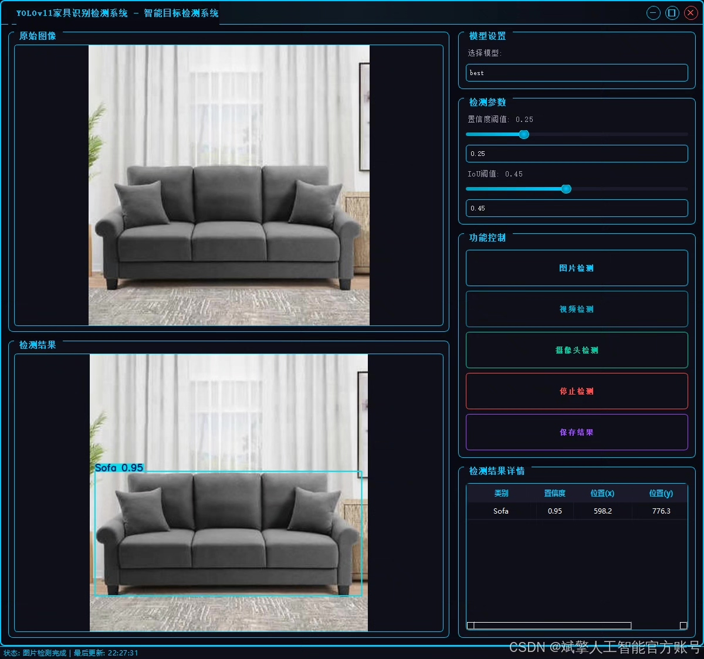
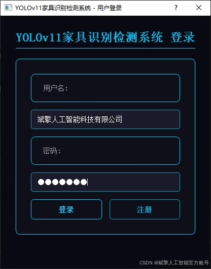
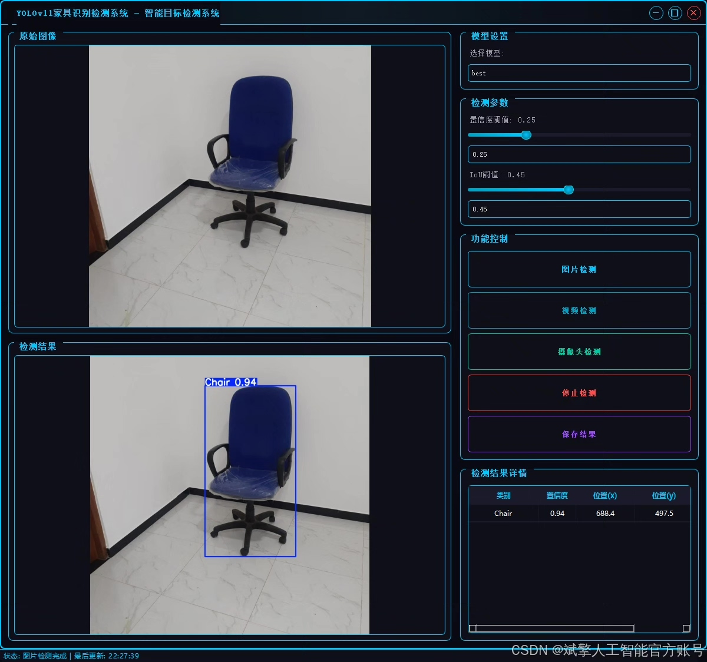
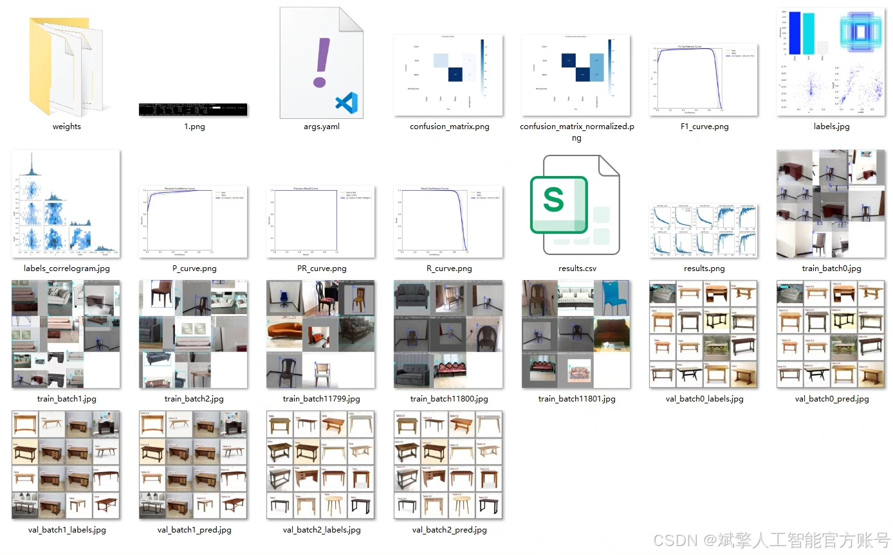
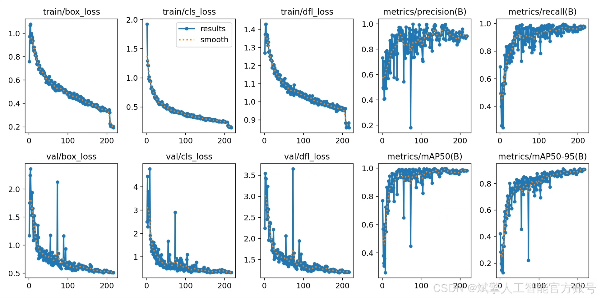
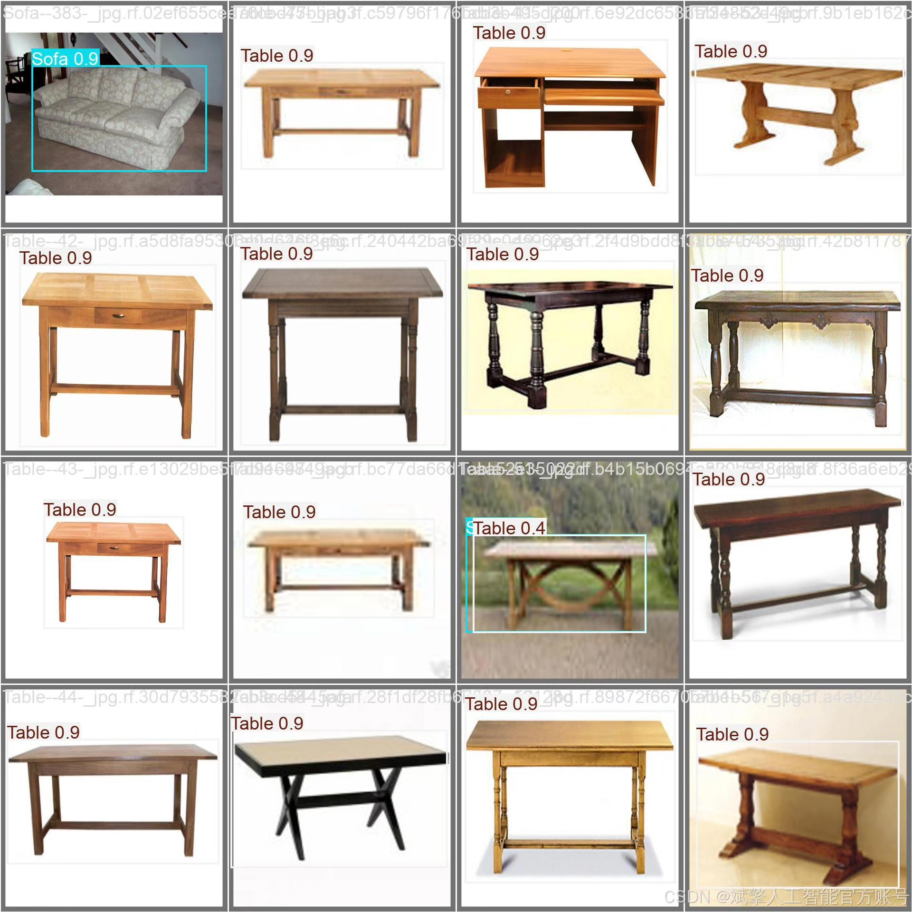

# Based on deep learning YOLOv11 for furniture recognition detection system (YOLOv11)

## Body

Based on the deep learning target detection algorithm YOLOv11, this paper designs and implements a furniture recognition detection system that can efficiently and accurately identify and locate common furniture categories in images, including chairs (Chair), sofas (Sofa), and tables (Table). The system uses the YOLOv11 model, combined with labeled YOLO format datasets for training. It has also developed a user-friendly UI interface in Python, supporting login and registration functions, enhancing the system's interactivity and practicality. Experimental results show that the system performs well in the training set (454 images), validation set (161 images), and test set (74 images), meeting the requirements of real-world furniture recognition scenarios.
✅ User Login and Registration: Supports password verification and security validation.
✅ Three detection modes: Based on the YOLOv11 model, supports image, video, and real-time camera detection, accurately identifying targets.
✅ Dual-screen comparison: Displays the original scene and detection results simultaneously on the screen.
✅ Data visualization: Real-time table displays the category, confidence, and coordinates of detected targets.
✅ Intelligent parameter adjustment: Offers a confidence slide bar to dynamically optimize detection accuracy, adapting to different scene needs.
✅ Sci-fi style interactive interface: Dark theme paired with dynamic light effects, reducing visual fatigue and improving operational experience.

## Images

## Payment

Here is a pay link on Stripe ( https://buy.stripe.com/3cs8yP7sY87d0vu9AB ). Please contact me lonlonago@foxmail.com after funding $89, and I will send you a complete data files , thank you!

